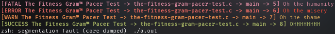
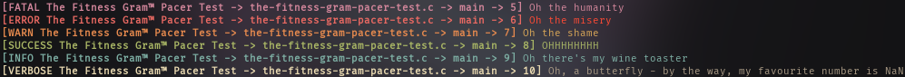

# Umber

Logging library for everything in the AQUA ecosystem.

## Building

On most Unix-like operating systems, build with:

```console
$ sh build.sh
```

This will compile the library, run a few tests, and install it to `/usr/local/lib` (`/usr/local/include` for the `umber.h` header).

## Basic usage

To use Umber in your project, include the `umber.h` header and define `UMBER_COMPONENT` with the name of the component it's meant to cover:

```c
#include <umber.h>
#define UMBER_COMPONENT "The Fitness Gram™ Pacer Test"
```

When compiling your program, you can link Umber as such:

```console
cc the-fitness-gram-pacer-test.c -lumber
```

(Notice the subtle play on words, which is difficult to notice; indeed, "Lumber" refers to processed wood, wood which is also what logs are made of.)
The header provides the following macros you can use for various log levels:

|Macro        |Level|POSIX stream|Description|
|-------------|-----|------------|-----------|
|`LOG_FATAL`  |0    |`stderr`    |An error occurred which prevents the component from continuing operation|
|`LOG_ERROR`  |1    |`stderr`    |An error occurred which may impair some of the component's functionality|
|`LOG_WARN`   |2    |`stderr`    |Something is not necessarily wrong, but is a bit unexpected|
|`LOG_SUCCESS`|3    |`stdout`    |The component executed a large operation successfully|
|`LOG_INFO`   |4    |`stdout`    |The component is doing something|
|`LOG_VERBOSE`|5    |`stdout`    |Extremely detailed information about what the component is currently doing|

These definitions are intentionally left a bit vague; the way you use these macros is mostly up to your own common sense.
The logging macros may be called as such:

```c
#include <umber.h>
#define UMBER_COMPONENT "The Fitness Gram™ Pacer Test"

int main(void) {
	LOG_FATAL("Oh the humanity")
	LOG_ERROR("Oh the misery")
	LOG_WARN("Oh the shame")
	LOG_SUCCESS("OHHHHHHHH")
	LOG_INFO("Oh there's my wine toaster")
	LOG_VERBOSE("Oh, a butterfly - by the way, my favourite number is %d", *(volatile int*) 0)

	return 0;
}
```

The output of this program is the following:



You set the `UMBER_LVL` environment variable to show more or less log messages (default is 3, here's an example with `UMBER_LVL=5` and without the segfault lol):



## Component filtering

Using the `UMBER_BLACKLIST` & `UMBER_WHITELIST` environment variables, you may filter out specific components to see things a little clearer or ease debugging problems in specific components (#5).
These environment variables take in a colon-separated list of components to either whitelist (exclusively show) or blacklist (hide) log entries coming from said components:

```console
UMBER_BLACKLIST=the:fitness program # blacklist components "the" & "fitness", i.e. ignore all log entries coming from those components
UMBER_WHITELIST=gram:pacer program # whitelist components "gram" & "pacer", i.e. only show log entries coming from those components
```

If both a whitelist and a blacklist are supplied, the blacklist takes precedence:

```components
UMBER_BLACKLIST=test UMBER_WHITELIST=test:tm program # blacklist component "test" only
```

Thank you for coming to my TED Talk.
